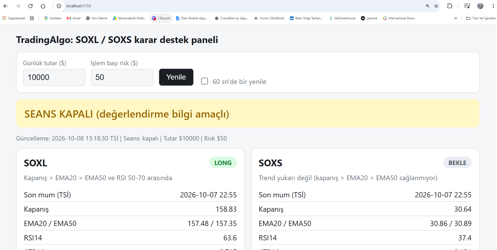

# TradingAlgo

SOXL / SOXS için gün içi sinyal ve risk hesabı yapan, **emir göndermeyen** bir ASP.NET Core (.NET) deneme projesi. Karar destek aracıdır: kararı ve işlemi kullanıcı verir.

> **Durum: park edildi (deneysel).** Gün içi kural seti geçmiş testte kriterleri geçmedi (aşağıya bak). Bu depo bir öğrenme/deney çalışmasıdır, yatırım tavsiyesi değildir.

## Ne yapar?

- Alpaca'dan (ücretsiz IEX feed) 1 dakikalık mumları çeker.
- 5 dakikalık mumlara toplar (sadece ABD normal seansı).
- EMA, RSI, ATR hesaplar.
- Risk tutarına göre pozisyon büyüklüğü (adet), stop ve hedef önerir.
- Basit backtest ve günlük trend testi içerir.
- TradingView webhook'u karşılayabilir (gizli anahtar + sembol listesi ile korumalı).

## Kurulum

Gereken: .NET SDK ve bir Alpaca **Paper** hesabı (ücretsiz).

```
git clone <repo-adresi>
cd TradingAlgo
dotnet user-secrets init
dotnet user-secrets set "Alpaca:KeyId" "..."
dotnet user-secrets set "Alpaca:SecretKey" "..."
dotnet user-secrets set "Webhook:Secret" "kendi-urettigin-anahtar"
dotnet run
```

Anahtarlar projenin dışında (`user-secrets`) saklanır, depoya girmez. `appsettings.json` içindeki risk rakamları örnektir; kendi değerlerini gir.

## Uç noktalar (GET, tarayıcıdan)

| Adres | Ne yapar |
|---|---|
| `/api/health` | Çalışıyor mu? |
| `/api/price/{sembol}` | Son işlem fiyatı |
| `/api/bars/{sembol}` | 1 dakikalık mumlar |
| `/api/indicators/{sembol}` | EMA20, EMA50, RSI14, ATR14 (1 dk) |
| `/api/sessions/{sembol}` | Seanslara göre mum sayısı ve hacim |
| `/api/five/{sembol}` | 5 dk göstergeler ve VWAP |
| `/api/signal?capital=&risk=` | SOXL / SOXS değerlendirmesi |
| `/api/backtest/{sembol}` | Gün içi kural backtesti |
| `/api/trend/{sembol}` | Günlük trend takibi testi (kodu yazıldı, sonuçlar henüz değerlendirilmedi) |
| `POST /api/webhook` | TradingView sinyali (gizli anahtar gerekir) |

## Bulgular

- Ücretsiz Alpaca verisi yalnızca IEX'tir: fiyat yaklaşık doğru, **hacim ve VWAP güvenilir değil** (TradingView ile VWAP farkı ~0,58$).
- Overnight seans verisi (`feed=boats`) dolu geliyor; pre-market ve after-hours IEX'te çok seyrek.
- Gün içi kural (5 dk, kapanış > EMA20 > EMA50 ve RSI 50-70, stop ATR bazlı), 10 Nisan - 6 Ekim 2026 döneminde 0,02$ kayma ile profit factor ≈ 0,96 verdi.
- Eğitim/test ayrımında test döneminde (Ağustos-Ekim) SOXL ve SOXS için profit factor 1'in altında kaldı; günlük rejim filtresi de tutarlı bir iyileşme sağlamadı.
- Backtest sınırları: yalnızca IEX verisi, tek bir güçlü yükseliş dönemi, komisyon yok.

## Yapılacaklar (fikirler)

- Günlük trend takibi testini çok yıllık veriyle çalıştırmak.
- QQQ / IEF (NQ ve faiz vekili) filtresini test etmek.
- Bildirim (Telegram) ve sinyal kaydı (paper takip).

## Uyarı

Bu proje eğitim amaçlıdır. Hiçbir çıktı yatırım tavsiyesi değildir; kaldıraçlı ETF'ler kısa sürede büyük kayıplara yol açabilir. Gerçek para riske etmeden önce kendi araştırmanı yap.